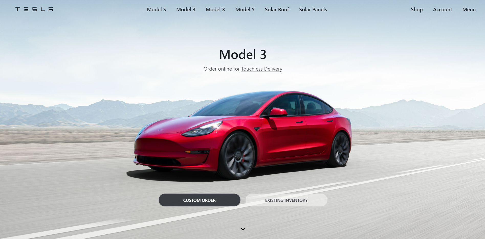

# Tesla-Clone



## Description

A Responsive real-like Tesla Clone created with ReactJs, Redux for state management, Css modules and Material-UI.


## Live Demo 🌐

**You Can See The `Clone` Live On:** [Here](https://tesla-clone-roan-zeta.vercel.app/)

## :rocket: Technologies used:

<p align="center">


</p>

## Additional Used
-  [x] NPM
-  [x] ES6 (Modules)
-  [x] Material-UI
-  [x] React Intersection Observer 

You can use any tools you like to help you complete the challenge. So if you've got something you'd like to practice, feel free to give it a go.

> ✅ **Feel Free To Fork and Contribute**

---

## ⭐ Features

-  [x] Active navbar like original
-  [x] Smooth scrolling like original
-  [x] Smooth animation like original
-  [x] Working side-menu
-  [x] Responsive design

## 🛠️ Installation Steps

1. Clone the repository

```bash
git clone https://github.com/HamedOsama/Tesla-Clone.git
```

2. Change the working directory

```bash
cd tesla-clone
```

3. Install dependencies

```bash
npm install
```

4. Run the app

```bash
npm run start
```

You are ready to build! Open [localhost:3000](http://localhost:3000/) to see the app.
## Authors

Developed by **Hamed Osama**

## Contact

-   Gmail: **[`hamedosama19@gmail.com`]**
-   **[LinkedIN](https://www.linkedin.com/in/hamed-osama-70b838206/)**
